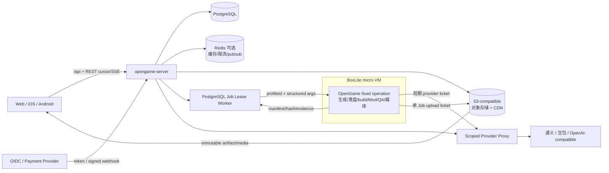

# PixelForge × OpenGame 架构与选型

**结论：采用“一个 Go 控制面 + 一个 OpenGame 生成内核 + BoxLite 隔离执行 + PostgreSQL/对象存储权威”的最小缝合，不再叠加工作流平台、美术微服务或第二套 SaaS 后端。**

## 1. 目标架构

| 设计原则             | 落法                                                                                                    |
| -------------------- | ------------------------------------------------------------------------------------------------------- |
| 业务权威只有一处     | PostgreSQL 保存指针、状态、关系、收入与审计；对象存储保存大文件                                         |
| 不可信代码不进主进程 | OpenGame 的项目落盘、依赖安装、build、Mod、QA、截图/转码均在 BoxLite；Go 只下发固定 operation 并验 hash |
| 实时不是权威         | v1 固定 REST cursor + SSE；Redis 只加速广播，Event 可从 PostgreSQL 重放                                 |
| 媒体跟版本走         | `publishedRevisionId + publishedMediaAssetSetId` 必须同事务切换且属于同一 Revision                      |
| 兼容不复制业务       | `/api/*` 为 PixelForge 合同；旧 `/v1/*` 只适配到同一 service                                            |
| 缓存可失效           | Redis 故障只影响速度/实时性，不影响 Job、账本和发布正确性                                               |

## 2. 已采纳选型总表

| 领域        | 选型                                         | 复用/新增                    | 复杂度 | 主要风险                                 | 控制办法                                                       |
| ----------- | -------------------------------------------- | ---------------------------- | ------ | ---------------------------------------- | -------------------------------------------------------------- |
| HTTP 控制面 | Go `net/http` + 现有 opengame-server         | 复用                         | 低     | 路由增多后 handler 膨胀                  | 按 domain service 分包，不换 Web 框架                          |
| 公共合同    | OpenAPI/JSON Schema + 生成 DTO               | 新增合同                     | 中     | Web/iOS/Android 漂移                     | CI 比较 schema 和 fixture；Mock 同源                           |
| 生产数据库  | PostgreSQL                                   | 新增生产 adapter             | 中     | 双库迁移、索引不足                       | SQLite 仅 dev；一次性迁移，生产无双写                          |
| 开发账本    | SQLite                                       | 保留                         | 低     | 被误用于生产                             | 配置在 production 拒绝 SQLite DSN                              |
| Job 队列    | PostgreSQL `FOR UPDATE SKIP LOCKED` lease    | 新增最小表/worker            | 中     | 长任务 lease、重复执行                   | heartbeat、幂等键、attempt、可恢复终态                         |
| 缓存/实时   | Redis，**仅生产按压测启用**                  | 条件新增                     | 中     | 变成隐藏权威                             | 仅 rate limit/cache/pubsub；所有状态可回源                     |
| 沙箱        | BoxLite                                      | 新增 adapter                 | 中高   | release 尚未含已合并网络修复             | feature flag；固定版本；安全验收后启用                         |
| 文件        | S3-compatible 对象存储 + CDN                 | 新增生产配置                 | 中     | 越权、脏对象、热链路成本                 | 预签名、tenant prefix、hash、生命周期策略                      |
| 图片        | `sharp`，补为 `packages/core` 直接依赖       | 复用现有实现                 | 低     | 当前只由 `@imgly` 间接带入，部署可能缺包 | 固定 manifest/lockfile；CI 做一张真实图片转换                  |
| 视频        | 固定 FFmpeg CLI/镜像 capability              | 补齐运行时声明               | 中     | 当前 I2V/抽帧已依赖但未形成部署门        | Step 4 preflight；缺失则关 I2V；Step 8 固定 H.264 profile      |
| AI 美术     | OpenGame 通义/豆包/OpenAI-compatible adapter | 复用并补 capability metadata | 中     | provider 差异、静默降级、取消不贯通      | sizes/edit/video/cancel 显式匹配，记录 requestId/成本/降级原因 |
| 媒体编排    | 现有 Job/worker 增加 media job               | 复用扩展                     | 中     | 旧任务覆盖新版本                         | Revision+hash+policyVersion 幂等键                             |
| 鉴权        | 托管 OIDC 优先，Go 验 JWT                    | 新增边界                     | 中     | 地区可用性、vendor lock                  | 标准 OIDC；User 只镜像 subject，不存 provider 密码             |
| 充值        | 首发单一 Payment Provider + Go webhook       | 新增边界                     | 中高   | 重复入账、退款、合规                     | 验签、幂等、追加式 ledger、服务端价格表                        |
| 社区        | PostgreSQL 关系表 + 游标                     | 新增                         | 中     | 热计数、刷量                             | 幂等唯一键、异步聚合、rate limit                               |
| 可观测性    | 结构化日志 + OpenTelemetry/Prometheus        | 复用 Go 生态                 | 中     | 高基数/敏感数据                          | request/job/tenant 三主键；字段白名单                          |

## 3. BoxLite 决策

| 项目                          | 结论                                                                                                                                                               |
| ----------------------------- | ------------------------------------------------------------------------------------------------------------------------------------------------------------------ |
| 选型                          | **BoxLite**，Apache-2.0，面向 agent 的嵌入式 micro-VM                                                                                                              |
| 官方仓库                      | <https://github.com/boxlite-ai/boxlite>                                                                                                                            |
| 2026-08-05 已发布版本         | `v0.9.7`，发布时间 2026-07-01                                                                                                                                      |
| 已合并但未进该 release 的修复 | [PR #1090 UDP egress allow_net](https://github.com/boxlite-ai/boxlite/pull/1090)、[PR #1106 host alias allow_net](https://github.com/boxlite-ai/boxlite/pull/1106) |
| 当前施工策略                  | 先实现 profile-based BoxLite runner、策略和验收；生产开关保持关闭                                                                                                  |
| 生产放行条件                  | 正式 release 包含两项修复；固定 checksum；网络/密钥/资源/逃逸测试全绿                                                                                              |
| 回退                          | 禁止不可信远端任务；开发环境可使用受限本机 runner，但不得称为安全沙箱                                                                                              |

### BoxLite 最小接入合同

| 输入                                                                                       | 输出                                                               | 强制策略                                             |
| ------------------------------------------------------------------------------------------ | ------------------------------------------------------------------ | ---------------------------------------------------- |
| `jobId, tenantId, inputRefs, profileId, operation, structuredArgs, timeout, networkPolicy` | `exit, stdoutRef, stderrRef, outputManifest, metrics, failureCode` | 不接收用户 shell command；CPU/内存/PID/磁盘/墙钟限制 |
| 只读基础镜像 + 独立 writable workspace                                                     | 仅上传 manifest 声明的产物                                         | 禁止挂载宿主仓库、Docker socket、用户目录            |
| provider 短期凭据或代理票据                                                                | 凭据不出现在日志和 artifact                                        | DB/Auth/对象存储主密钥永不注入                       |
| 默认无网                                                                                   | 精确域名/IP/端口 allowlist                                         | DNS、TCP、UDP、host alias 都必须测试                 |

## 4. 数据、任务与实时状态

### 4.1 PostgreSQL 与 SQLite

| 选项                | 优点                                            | 代价                                   | 建议                           |
| ------------------- | ----------------------------------------------- | -------------------------------------- | ------------------------------ |
| PostgreSQL 生产权威 | 并发、事务、索引、JSON、`SKIP LOCKED`、备份成熟 | 需要迁移与运维                         | **采用**                       |
| SQLite 生产主库     | 单机简单                                        | 多实例、热写、备份、队列、社区关系受限 | **排除**                       |
| SQLite 本地模式     | 单二进制、测试快                                | 与生产 SQL 有差异                      | **保留，但生产配置 fail-fast** |

生产不做 SQLite→PostgreSQL 长期双写。迁移期先停止写入、导入、校验计数/hash，再切 DSN；回滚只回服务版本，不回到双主。

### 4.2 Job 与事件

| 能力       | 最小实现                                      | 何时升级                       |
| ---------- | --------------------------------------------- | ------------------------------ |
| Job 领取   | PostgreSQL lease + `SKIP LOCKED`              | 单库成为实测瓶颈时再拆专用队列 |
| Job 恢复   | heartbeat/leaseUntil/attempt/maxAttempts      | 不引入全量工作流 DSL           |
| 事件       | events 表顺序号 + REST cursor                 | Redis pubsub 只为低延迟广播    |
| 跨表一致性 | 同事务写业务行 + outbox/event                 | 外部 webhook/对象删除异步消费  |
| 取消       | Job cancel_requested，worker 协作终止 BoxLite | 终态后取消返回幂等结果         |

## 5. 媒体、美术与视频

| 问题       | 当前最小方案                                    | 不做的事                     |
| ---------- | ----------------------------------------------- | ---------------------------- |
| 多比例     | AI 产横/竖两个无字母版；sharp 派生 thumbnail/OG | 不独立调用 AI 生成四张图     |
| 标题乱码   | 确定性文字叠加、本地化字体和 safe area          | 不让 AI 直接画关键文字       |
| Hero 成本  | 仅精选游戏触发 3:1，允许人工锁版                | 不为每个发布版本生成 Hero    |
| 实机一致性 | 最终 QA 后取标题页/关键场景截图 + creative spec | 不只根据最初 Prompt 生宣传图 |
| 修改频率   | 仅 publish candidate 或人工重生触发             | 不随每次实时试调重生         |
| 视频       | FFmpeg 产 4–6 秒 H.264 MP4、Fast Start          | 首版不做 HLS，不要求 WebM    |
| 审核       | prompt 前审 + 生成后图像/视频审 + lineage       | 不先公开 URL 再补审核        |

OpenGame 当前由 `@imgly/background-removal-node` 间接带入 `sharp ~0.32.4`（lockfile 为 `0.32.6`），源码却已直接 import。实施时必须把 `sharp` 写入 `packages/core/package.json` 并锁版本；这是修正依赖声明，不另选图片库。

当前 OpenGame 没有 cover/hero/OG/screenshot/`MediaAssetSet` 生产者，下面是**必须新增**的最小 MediaJob，不得把目标合同写成现状能力。

| MediaJob  | 合同                                                                                                   |
| --------- | ------------------------------------------------------------------------------------------------------ |
| 输入      | `revisionId, artifactHash, screenshotEvidence[], creativeSpec, roles[], policyVersion, idempotencyKey` |
| 处理      | BoxLite 内截图/FFmpeg；provider adapter 产横竖母版；sharp 派生；逐项审核                               |
| 输出      | `MediaAssetSet + MediaAsset[] + MediaGenerationAttempt[] + itemResults[]`                              |
| 必需/可选 | cover、coverPortrait、thumbnail、OG、portrait MP4 为发布必需；Hero 仅精选必需；landscape MP4 可选      |
| 原子性    | Job 只产 draft/approved set；发布事务校验 set.revisionId 后同时切两个 published 指针                   |

动态 OG 不由 Vite SPA 猜测。反向代理把 `/g/:slug` 交给 Go/edge 输出可抓取 HTML，并在发布/回滚时按 slug purge；HTML 再加载或跳转 PixelForge 客户端页面。

## 6. 账户、充值与 ShipAny

PixelForge 是 **Vite + React 19 SPA**，opengame-server 是 Go。ShipAny One 当前是 **Next.js 15 + NextAuth + Drizzle + Stripe/Creem**，整体合并会制造第二套服务端和数据层。

| 方案                     | 优点                                      | 代价/冲突                                           | 建议                         |
| ------------------------ | ----------------------------------------- | --------------------------------------------------- | ---------------------------- |
| 整体迁入 ShipAny         | 账户、支付、后台页面现成                  | Vite→Next 迁移；Go/Drizzle 双权威；路由和 UI 大重构 | **排除**                     |
| 购买后选择性移植         | 可借表结构、页面、邮件、订单/webhook 流程 | 仍需改成 PixelForge API 与设计系统                  | **采用为参考，不作运行依赖** |
| Go 自研密码登录          | 单栈                                      | 安全、找回、MFA、风控维护成本高                     | **排除**                     |
| 标准 OIDC + Go 用户镜像  | 三端通用、可替换 provider                 | 仍需选地区可用 provider                             | **采用**                     |
| 单支付 provider + ledger | 最小上线面、易对账                        | 第二地区支付需后续扩展                              | **采用**                     |

采购前只核对能否合法复用代码、UI 与数据库设计；不要因为“已购买”而迁入无调用方的模块。

### 必须在商业施工前确认

| 决策          | 默认值               | 改变默认值的条件                                         |
| ------------- | -------------------- | -------------------------------------------------------- |
| 首发市场      | 海外优先             | 若首发中国大陆，支付和身份 provider 必须重选并做合规评审 |
| 支付 provider | Stripe（海外默认）   | 商务明确要求 Creem/微信/支付宝时再替换，不首发多接       |
| 虚拟积分      | 仅平台内消费，不提现 | 若涉及转赠/提现/创作者分成，先做法务、税务和 KYC 方案    |

## 7. Feed 与 5–10 万 DAU

| 层        | 选型                                              | 复杂度控制                                 |
| --------- | ------------------------------------------------- | ------------------------------------------ |
| Feed 查询 | PostgreSQL cursor + 预计算计数；热门页短 TTL 缓存 | 不首发推荐系统平台                         |
| 静态媒体  | CDN + 响应式图片                                  | API 不转发视频字节                         |
| 视频      | 当前卡播放，前后卡只 poster/metadata              | 不预取相邻 iframe/runtime                  |
| attract   | 显式 `mode=attract && attractSafe=true`           | 缺策略/省流/Reduce Motion 退静态           |
| 实时事件  | v1 固定 REST cursor + SSE；多实例时 Redis pubsub  | WebSocket 后置，避免同时维护两套客户端合同 |
| 限流      | user/IP/tenant/job-type 令牌桶                    | Redis 不可用时本机保守限流或拒绝昂贵任务   |

5–10 万 DAU 不要求首日上 Kafka、服务网格或多区域数据库；它要求先把无状态 API、CDN、PostgreSQL 索引、幂等和压测做实。

## 8. 候选与排除项

| 候选                      | 状态           | 排除/降级理由                                    | 重新评估触发器                                   |
| ------------------------- | -------------- | ------------------------------------------------ | ------------------------------------------------ |
| 腾讯云 AGSX / CubeSandbox | **排除**       | 用户明确不依赖腾讯；供应商锁定和部署边界不合要求 | 无，除非产品战略主动改变                         |
| Docker 单独作安全沙箱     | **排除**       | 容器不是足够的不可信代码安全边界                 | 仅本地可信构建可用                               |
| Firecracker / Kata        | **排除首发**   | 运维、镜像、网络和平台复杂度高                   | BoxLite 无法满足隔离/吞吐验收                    |
| gVisor                    | **备选**       | Linux 容器栈复杂度高于当前方案                   | BoxLite release/性能长期不达标                   |
| E2B/远程沙箱 SaaS         | **排除首发**   | 外部依赖、成本、数据驻留和 vendor lock           | 自建容量成为主要瓶颈且合规允许                   |
| nsjail/bubblewrap         | **不作主方案** | Linux 专用、能力拼装多、macOS 开发体验割裂       | 只作为 CI Linux 补充防线                         |
| Temporal                  | **暂不引入**   | 当前 Job 状态机可由 PG lease 覆盖                | 跨天人工审批/补偿流程显著增多且 PG 方案失控      |
| Kafka/NATS/RabbitMQ       | **暂不引入**   | 首发没有需要独立消息平台的实测吞吐               | outbox 消费延迟/积压超过 SLO                     |
| ComfyUI 生产集群          | **暂不引入**   | 现有 provider adapter 足够；新增 GPU 编排过重    | 节点化可复现工作流成为明确产品需求               |
| 独立美术微服务 / 重型 DAM | **排除首发**   | 版本、审核、任务已能在现有脊柱表达               | 专职美术团队和资产规模证明需要独立治理           |
| GitLab 作 Game/Mod 权威   | **排除**       | 业务指针、lineage、收入和权限更适合 PostgreSQL   | 多文件 diff/merge/audit 成为硬需求时只做异步镜像 |
| Redis 作 Job/余额权威     | **排除**       | 故障恢复和事务边界不适合                         | 无；Redis 始终只做可丢状态                       |
| 每次修改重生宣传图        | **排除**       | 成本高、抖动、旧任务覆盖风险                     | 只允许用户显式重生或 publish candidate 触发      |
| 每版四张独立 AI 图        | **排除**       | 风格漂移和成本放大                               | 横/竖母版无法满足某特殊渠道时单独加 role         |
| 短预览 HLS                | **排除首发**   | 4–6 秒 MP4 足够，切片/清单/缓存复杂度无收益      | 预览变成长视频或直播                             |
| 全作品人工 GM 审批        | **排除**       | 吞吐与成本不可扩展                               | 高风险、举报、精选、商业活动才转人工             |

## 9. 复杂度预算

| 阶段             | 允许新增的基础设施                                                                              | 明确禁止                            |
| ---------------- | ----------------------------------------------------------------------------------------------- | ----------------------------------- |
| 首个真闭环       | PostgreSQL、S3-compatible storage、真实 OIDC、BoxLite adapter、FFmpeg preflight（或明确关 I2V） | Redis、支付可暂不阻塞内部 Create    |
| 移动媒体上线     | 固定 FFmpeg H.264 profile、CDN 转码队列                                                         | HLS、独立媒体平台                   |
| 5–10 万 DAU 压测 | Redis（若指标需要）、只读副本（若慢查询需要）                                                   | 未经压测直接上 Kafka/服务网格       |
| 商业上线         | 单支付 provider、ledger、对账                                                                   | 第二套 Next.js 后端、多支付并行首发 |

## 10. 外部资料快照

| 来源                                                                   | 用途                               | 注意                                                                |
| ---------------------------------------------------------------------- | ---------------------------------- | ------------------------------------------------------------------- |
| <https://github.com/boxlite-ai/boxlite>                                | BoxLite 版本、许可、release 与修复 | 能力必须绑定具体 release，不以 main 代替发布版                      |
| <https://cloud.tencent.com/product/agsx>                               | 腾讯方案对比                       | 已排除，不是运行依赖                                                |
| <https://github.com/TencentCloud/CubeSandbox/blob/master/README_zh.md> | CubeSandbox 对比                   | 已排除，不是范例实现                                                |
| <https://shipany.ai/templates>                                         | 账户、订单、积分、后台参考         | 只选择性移植，不整体并入                                            |
| <https://github.com/shipany-ai/shipany-one>                            | ShipAny 技术栈核验                 | VIP/登录授权仓；未认证访问返回 404，采购/移植时核对许可并重新锁版本 |
